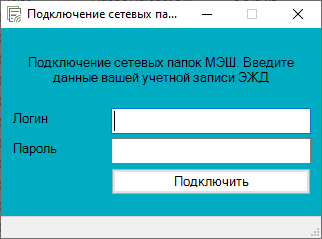
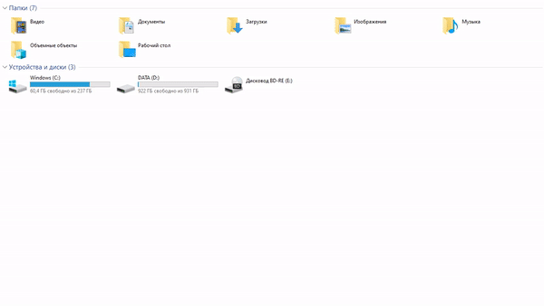

# MountShares-GUI

Интерфейс для подключения сетевых дисков (HOME, Share, Data) на компьютерах вне домена [МЭШ](https://www.mos.ru/city/projects/mesh/).

## Скриншот



## Демо



## Требования

* Доступность домена из сети компьютера, на котором нужно подключить диски. Для проверки: `ping ОКРУГ.obr.mos.ru` (замени `ОКРУГ` на свой).
* Windows, Powershell и .NET Framework (проверял на Windows 7 (с установленным WMF 5.1) и Windows 10 с включенными 3.5 и 4.8)

## Использование

1. Клонировать/скачать этот репозиторий
1. Перейти в папку репозитория
1. Открыть `MountShares-GUI.ps1` и заменить значения переменных `$DomainName` и `$SchoolName` на свои
1. Установить [PS2EXE](https://github.com/MScholtes/PS2EXE)
    * запустить PowerShell от имени администратора
    * выполнить команду `Install-Module ps2exe`
    * закрыть все окна PowerShell
1. Собрать exe-файл: запустить PowerShell в папке репозитория и выполнить команду

    ``` powershell
    ps2exe `
    -InputFile '.\MountShares-GUI.ps1' `
    -OutputFile '.\MountShares-GUI.exe' `
    -iconFile '.\favicon.ico' `
    -title 'Подключение сетевых папок МЭШ' `
    -product 'MountShares-GUI' `
    -copyright 'pavlov@vkapotne.ru' `
    -version 0.1.0.0 `
    -x86 `
    -verbose `
    -noConfigfile `
    -noConsole
    ```

1. Запустить файл `MountShares-GUI.exe`
1. Ввести логин в виде `username` без каких-либо префиксов и суффиксов и пароль от ЭЖД
1. Если диски подключились, значит всё работает как задумано, и теперь файл можно распространить на другие компьютеры
